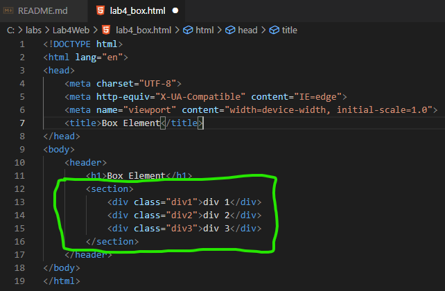

# Lab4Web

# NAMA  : Ibnu Fajar
# NIM   : 312010420
# KELAS : TI. 20. A1

# Langkah-langkah Praktikum
 Seperti biasa kalian buka Visual Studio Code Dileptop kalian dan lakukan seperti biasa membuat file html, yang bernama "lab4_box.html" kita akan belajar membuat Box Element.

 Langkah pertama kita buka file yang telah kita buat, dan memasukan code perintah seprti gambar berikut:
 
 Seprti biasa kalian run dan lihat hasilnya digoogle crome.
 

 Langkah kedua kita 